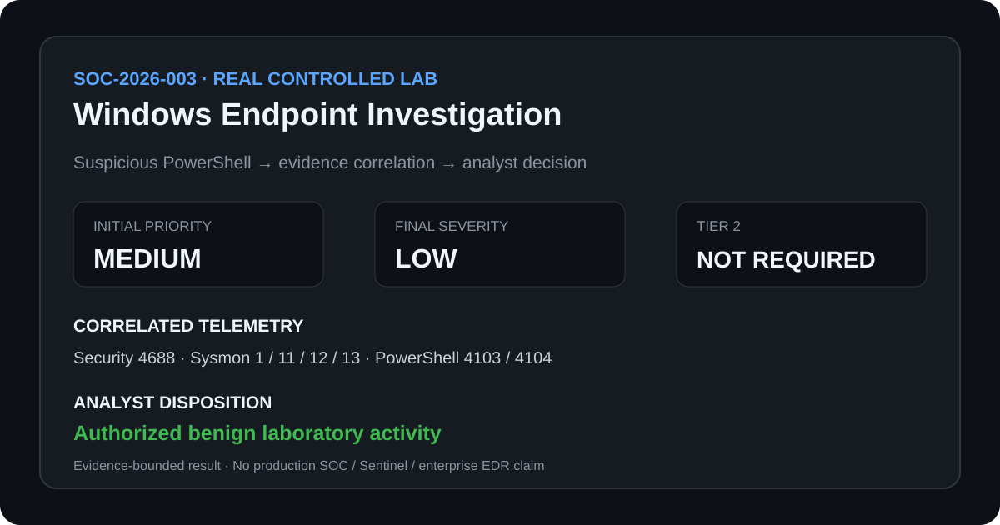

# SOC-2026-003 — Windows Endpoint Investigation

> **REAL CONTROLLED LAB** | Real endpoint-generated Windows telemetry | **541 normalized source events** | Initial priority: **Medium** → Final severity: **Low**

## What happened

Suspicious-looking PowerShell execution, including `-EncodedCommand`, occurred alongside Registry and file activity on an authorized disposable Windows laboratory endpoint.

The combination warranted investigation because encoded PowerShell, Registry modification and file creation can require additional context before an analyst can distinguish benign activity from malicious execution, persistence or harmful file activity.

## Investigation path

`PowerShell signal → Windows telemetry → process correlation → encoded-content review → Registry/file review → timeline reconstruction → severity reassessment → disposition`

I correlated Windows Security, Sysmon and PowerShell Operational telemetry, reviewed the encoded PowerShell content, examined the Registry and file activity, reconstructed the sequence and tested whether the evidence supported malicious execution, persistence or an authorized explanation.

## What I found

- Windows Security Event ID 4688 and Sysmon Event ID 1 independently recorded corresponding PowerShell process creation.
- PowerShell Operational Event ID 4104 exposed the harmless payload associated with the controlled `-EncodedCommand` execution.
- Sysmon Event IDs 12/13 recorded temporary Registry activity; the observed value was a laboratory marker rather than an autostart configuration.
- Sysmon Event ID 11 recorded creation of a temporary marker file, and cleanup activity was subsequently observed.
- Correlation across Security, Sysmon and PowerShell telemetry supported the authorized controlled-lab explanation with high confidence within the retained evidence scope.

**Key sequence:** `process creation → script-block context → encoded payload review → Registry activity → file creation → cleanup`

## Why it mattered

**FACT:** The final collection contained 541 normalized source events from real endpoint-generated telemetry. The relevant investigation sequence was independently observable across Windows Security, Sysmon and PowerShell Operational records.

**ASSESSMENT:** Encoded PowerShell, Registry modification and file creation justified an initial Medium triage priority, but none of those observations independently established malicious activity. Payload inspection, Registry context, file context, cross-source correlation, authorization and observed cleanup did not support malicious encoded execution, persistence or malware activity within the retained evidence scope.

## Decision

| Decision point | Result |
|---|---|
| Initial laboratory triage priority | **Medium** |
| Post-investigation severity | **Low** |
| Disposition | **Close as authorized benign laboratory activity** |
| Tier 2 escalation | **Not required for the completed scenario** |

The investigation moved from a suspicious-looking signal to an evidence-supported benign disposition without converting observable behaviors into unsupported claims of compromise.

## Evidence

| Source | Key evidence used |
|---|---|
| Windows Security | Event ID 4688 — PowerShell process creation |
| Sysmon | Event ID 1 — process corroboration; 11 — file creation; 12/13 — Registry activity |
| PowerShell Operational | Event IDs 4103/4104 — command, script-block and cleanup context |

[Full investigation](investigation.md) → [Timeline](timeline.csv) → [Findings](findings.md) → [Public correlation evidence](../../10-evidence/SOC-2026-003/windows-endpoint-correlation.md) → [Disposition / escalation boundary](escalation.md)

## Evidence boundary

This was an authorized controlled laboratory investigation using real endpoint-generated Windows telemetry. It does not represent a production incident, confirmed compromise, production containment, enterprise EDR/XDR detection or Microsoft Sentinel execution.
