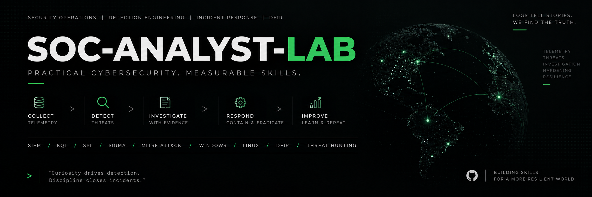

# SOC Analyst Lab

Hands-on **SOC investigation portfolio** showing how I move from an alert or security signal to evidence correlation, timeline reconstruction, severity assessment, disposition and escalation.

**ALERT → INVESTIGATE → CORRELATE EVIDENCE → ASSESS SEVERITY → ESCALATE / CLOSE**

## See a complete investigation in 3 minutes

**[SOC-2026-003 — Windows endpoint investigation](03-investigations/SOC-2026-003/CASE_OVERVIEW.md)**

Real endpoint-generated Windows Security, Sysmon and PowerShell telemetry across **541 normalized source events**.

**Analyst path:** suspicious activity → multi-source correlation → encoded-PowerShell and Registry/file review → timeline reconstruction → severity reassessment → documented disposition.

[Investigation](03-investigations/SOC-2026-003/investigation.md) → [Evidence](10-evidence/SOC-2026-003/windows-endpoint-correlation.md) → [Timeline](03-investigations/SOC-2026-003/timeline.csv) → [Findings](03-investigations/SOC-2026-003/findings.md) → [Disposition](03-investigations/SOC-2026-003/escalation.md)

## Three cases to review

| Case | Evidence | Analyst work |
|---|---|---|
| **[SOC-2026-003 — Windows endpoint](03-investigations/SOC-2026-003/CASE_OVERVIEW.md)** | Real endpoint-generated Windows Security, Sysmon and PowerShell telemetry | Correlation, timeline reconstruction, PowerShell/Registry/file analysis, severity reassessment and disposition |
| **[SOC-2026-005 — Network traffic](03-investigations/SOC-2026-005/investigation.md)** | Real controlled-lab loopback PCAP with TShark and Zeek-derived telemetry | HTTP sequence reconstruction, timing analysis, file-transfer correlation, hypothesis testing and disposition |
| **[SOC-2026-001 — SSH authentication](03-investigations/SOC-2026-001/evidence-review.md)** | Retained controlled-lab Linux authentication excerpt | Failed/successful authentication correlation, privileged-command analysis and escalation reasoning |

## Demonstrated SOC workflow

- **Triage:** establish alert context, source, asset, account and time window.
- **Investigate:** preserve and correlate endpoint, authentication or network evidence.
- **Reconstruct:** build a bounded timeline and test alternative explanations.
- **Decide:** reassess severity and distinguish observations from hypotheses.
- **Act:** document disposition and escalate when the evidence warrants it.

## Additional technical depth

- **Detection engineering:** Sigma rules, KQL analysis, positive/negative controls and documented semantic limitations.
- **Windows investigation:** Security, Sysmon and PowerShell telemetry across host, process and time context.
- **Network analysis:** PCAP review with TShark and Zeek.
- **Authentication analysis:** failed/successful login correlation and privileged-command review.
- **Automation:** Python timeline normalization and bounded event correlation.
- **Engineering:** unit tests, repository validation and GitHub Actions quality gates.

[SOC-2026-004 — Sigma/KQL detection investigation](03-investigations/SOC-2026-004/investigation.md) · [SOC-2026-002 — identity correlation](03-investigations/SOC-2026-002/investigation.md) · [Detection evidence states](04-detection-rules/kql/README.md) · [Reproduction](REPRODUCE.md)

## Scope boundary

The workflow is **validate → collect context → correlate → test alternatives → assess severity → document → escalate or close**.

An event, ATT&CK mapping, suspicious path, passing fixture test or successful backend translation does not independently prove malicious intent, persistence execution or effective production detection. Live Microsoft Sentinel, Defender XDR and Entra investigations, phishing analysis and operational ticket handling are not claimed as demonstrated production capabilities.

## What is implemented

- [Python timeline builder](05-automation/build_timeline.py): source preservation, UTC normalization and bounded host/session/process correlation.
- [Unit tests](tests/test_soc004.py) and [detection fixtures](07-lab/detection-tests/): positive and negative controls for documented local models.
- [Evidence and severity runbook](01-runbooks/evidence-and-severity.md), [triage procedure](01-runbooks/alert-triage.md) and [analyst templates](09-templates/README.md).
- [CI definition](.github/workflows/security-quality-gate.yml): Sigma parsing, SOC/portfolio tests, Windows collection validation, detection tests and isolated Sigma backend-translation reproducibility. A workflow file is configuration; check the matching commit's completed run before claiming remote success.

## Repository map

| Path | Contents |
|---|---|
| [00-governance](00-governance/README.md) | Scope, publication and evidence controls |
| [01-runbooks](01-runbooks/README.md) / [02-alerts](02-alerts/README.md) | Procedures / alert documentation area |
| [02-datasets](02-datasets/soc-2026-004/README.md) | Synthetic Windows fixtures |
| [03-investigations](03-investigations/README.md) / [03-dfir](03-dfir/key-artifacts-matrix.md) | Cases / collection methodology |
| [04-detection-rules](04-detection-rules/README.md) | Sigma, KQL and mapping limitations |
| [05-automation](05-automation/build_timeline.py) / [tests](tests/test_soc004.py) | Timeline implementation / unit assertions |
| [05-threat-intelligence](05-threat-intelligence/README.md) / [06-scripts](06-scripts/README.md) | Threat-intelligence area / validation utilities |
| [07-lab](07-lab/README.md) / [08-tryhackme](08-tryhackme/README.md) | Lab procedures / training boundaries |
| [09-reports](09-reports/README.md) / [09-templates](09-templates/README.md) | Reporting area / reusable analyst templates |
| [10-evidence](10-evidence/README.md) | Sanitized derived Windows endpoint evidence, reviewed controlled-lab network traffic and authentication excerpts, and synthetic identity data |

Directory presence alone does not mean a capability is demonstrated.

## Evidence, reuse and assistance

Only reviewed synthetic, sanitized or explicitly approved artifacts belong here. Do not commit credentials, personal/customer information, raw sensitive captures, training flags or proprietary solutions. See [governance](00-governance/README.md) and [security reporting](SECURITY.md).

No open-source reuse license has been selected. Public visibility is not a blanket license to copy, modify or redistribute the material; third-party rights remain applicable. See the [reuse decision](00-governance/REUSE.md).

AI tools, including ChatGPT and Codex, may assist exercises, drafting and repository engineering. Claims remain bounded by retained artifacts; reviewed code and automated outputs still require the stated validation. AI assistance is not an independently demonstrated SOC capability.
